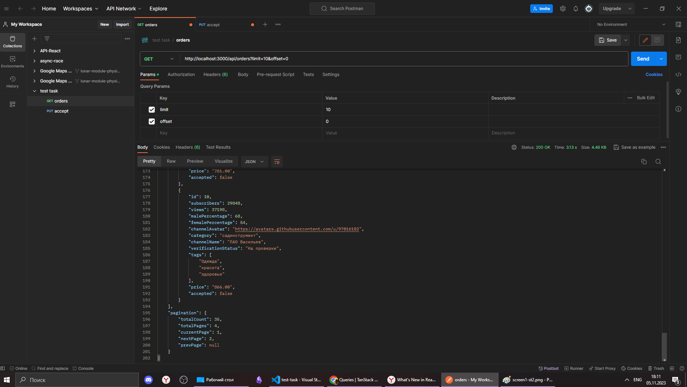
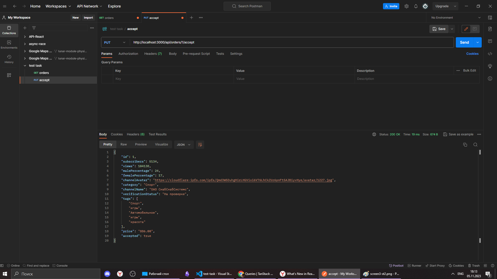
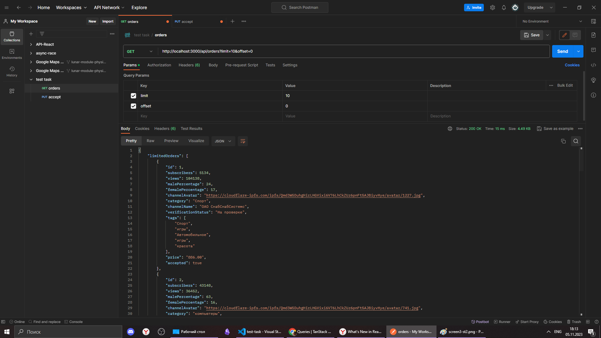

# Test task

Данный проект представляет собой тестовое задание - реализацию части веб-страницы, написанную на Next.js, React, TypeScript, Tanstack Query v5 и Chakra UI.

Чтобы запустить проект:

1. Установите зависимости

```
npm install
```

1. Запустите проект в режиме разработки

```
npm run dev
```

И перейдите на страницу [http://localhost:3000/advertisers/orders/order/application](http://localhost:3000/advertisers/orders/order/application)

2. Или запустите сборку проекта:

```
npm run build
```

И позже запустите собранную версию:

```
npm start
```

Пожалуйста, убедитесь, что у вас установлен Node.js и все необходимые зависимости перед запуском проекта.

## Workflow

1. Stage 1


2. Stage 2

Результат GET запроса - начало ответа


Результат GET запроса - конец ответа с totalCount


Результат PUT запроса, изменен accepted


Результат GET запроса после PUT, изменен accepted


3. Stage 3
