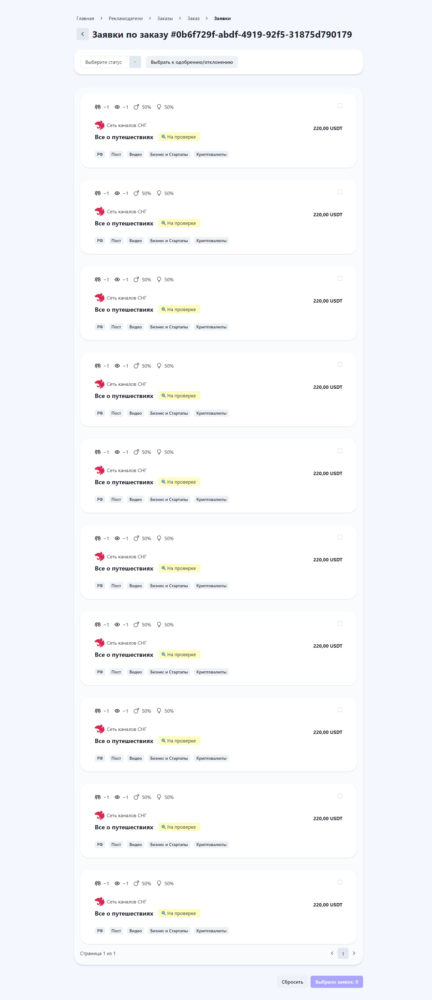
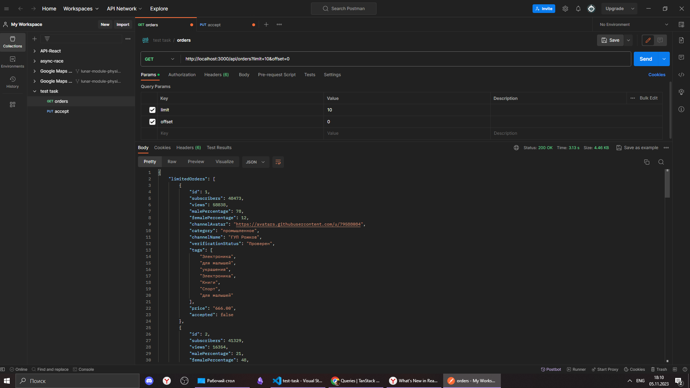

## Workflow

1. Stage 1

2. Stage 2

Результат GET запроса - начало ответа

Результат GET запроса - конец ответа с totalCount

Результат PUT запроса, изменен accepted

Результат GET запроса после PUT, изменен accepted

3. Stage 3
